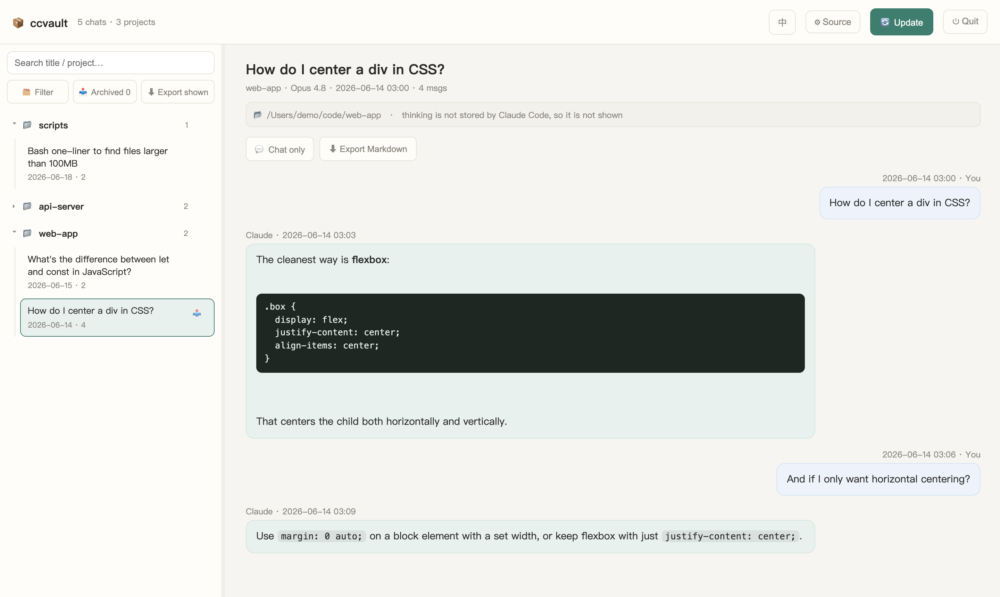

# 📦 ccvault — Claude Code Vault

**English** · [中文](README.zh.md)

Back up, browse, search, and export your [Claude Code](https://claude.com/claude-code) conversations — **100% local, zero dependencies, no network**.



*Browse, search, filter, archive, and export — in English or 中文 (one-click toggle). All data stays on your machine.*

Claude Code stores your chats as `.jsonl` transcripts under `~/.claude/projects`. They're complete but hard to read, and they can be lost if Claude Code is reinstalled or cleaned. **ccvault** turns them into a clean local archive you fully own, with a browser UI to read, search, and export them.

## Features

- 🗂 **Browse** every conversation in a foldered, searchable sidebar
- 💬 **Readable** chat-bubble view; tool calls & results collapsible; a **"chat only"** mode that hides everything but the messages
- 🔍 **Filter** which projects to show; **archive** (hide) individual chats — restorable anytime
- ⬇ **Export** a single chat, a whole project, or everything you currently see — as Markdown / a zip
- 🔄 **Incremental update** — only new or changed chats get reprocessed
- ♊ **Auto-dedupe** — Claude Code saves a fresh snapshot every time you resume a chat; ccvault keeps only the most complete one, so the same conversation never shows up twice (`--no-dedupe` keeps them all)
- 🔒 **Private by design** — runs entirely on `127.0.0.1`, never touches the network, never modifies your original transcripts

## Requirements

- **Python 3.8+** — standard library only, nothing to `pip install`
- A modern web browser

## Quick start

```bash
git clone https://github.com/Ethan-YS/ccvault.git
cd ccvault
python3 ccvault.py
```

It auto-detects `~/.claude/projects`, builds a local archive at `~/.ccvault/archive`, and opens your browser.

- **macOS** — double-click `ccvault.command`
- **Windows** — double-click `ccvault.bat`
- **Linux / anything** — `python3 ccvault.py`

## Options

```
python3 ccvault.py --src PATH      # custom transcripts folder
python3 ccvault.py --out PATH      # custom archive output folder
python3 ccvault.py --port 8765
python3 ccvault.py --copy-raw      # also copy the original .jsonl into the archive
python3 ccvault.py --no-dedupe     # keep every snapshot (don't merge resume duplicates)
python3 ccvault.py --update-only   # rebuild the archive and exit (no server)
```

You can also point ccvault at a different transcripts folder from the web UI (**⚙︎ Source**) — useful if your `.claude` lives somewhere non-standard, or to browse a backup.

## Privacy

- Everything runs **locally**. There are **no network calls, ever.**
- Your transcripts are read **read-only**; the originals under `~/.claude/projects` are never modified.
- The archive lives at `~/.ccvault/archive` — **outside this repo**. Conversation data is **never committed** (`.gitignore` blocks it).

## Notes

- Claude Code does **not** store the model's *thinking* text in transcripts (only an encrypted signature), so thinking can't be shown or exported. This is a limitation of the source data, not ccvault.

## License

[MIT](LICENSE)
