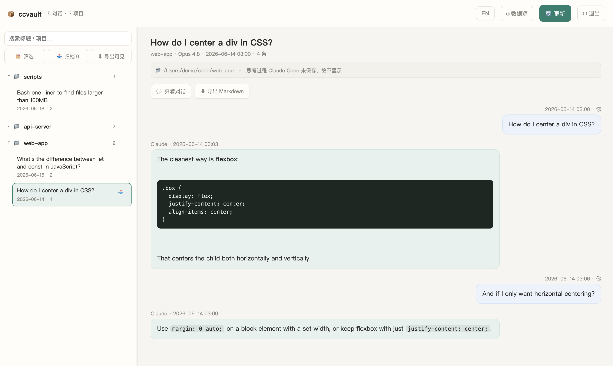

# 📦 ccvault — Claude Code Vault

[English](README.md) · **中文**

备份、浏览、搜索、导出你的 [Claude Code](https://claude.com/claude-code) 对话 —— **100% 本地、零依赖、不联网**。



*浏览、搜索、筛选、归档、导出 —— 中文 / English 一键切换。所有数据都留在你自己的机器上。*

Claude Code 把你的对话以 `.jsonl` 文件存在 `~/.claude/projects` 下。它们很完整,却很难读,而且一旦 Claude Code 被重装或清理就可能丢失。**ccvault** 把它们转成一份你完全拥有的本地存档,再配一个网页界面来阅读、搜索和导出。

## 功能

- 🗂 **浏览** —— 可折叠、可搜索的侧边栏,按项目分组管理每一条对话
- 💬 **易读** —— 聊天气泡视图;工具调用与返回结果可折叠;还有"只看对话"模式,隐藏一切只留消息
- 🔍 **筛选 / 归档** —— 选择显示哪些项目;单独归档(隐藏)某条对话,随时可恢复
- ⬇ **导出** —— 单条对话、整个项目、或当前所见的全部 —— 导出成 Markdown / zip
- 🔄 **增量更新** —— 只重新处理新增或有改动的对话
- ♊ **自动去重** —— Claude Code 每次续聊都会存一份新快照;ccvault 只保留最完整的那份,同一对话不会重复出现(`--no-dedupe` 可保留全部)
- 🔒 **隐私优先** —— 完全运行在 `127.0.0.1`,从不联网,从不改动你的原始对话文件

## 环境要求

- **Python 3.8+** —— 只用标准库,无需 `pip install` 任何东西
- 一个现代浏览器

## 快速开始

```bash
git clone https://github.com/Ethan-YS/ccvault.git
cd ccvault
python3 ccvault.py
```

它会自动找到 `~/.claude/projects`,在 `~/.ccvault/archive` 建好本地存档,并打开你的浏览器。

- **macOS** —— 双击 `ccvault.command`
- **Windows** —— 双击 `ccvault.bat`
- **Linux / 其它** —— `python3 ccvault.py`

## 选项

```
python3 ccvault.py --src PATH      # 自定义对话源文件夹
python3 ccvault.py --out PATH      # 自定义存档输出文件夹
python3 ccvault.py --port 8765
python3 ccvault.py --copy-raw      # 同时把原始 .jsonl 一并复制进存档
python3 ccvault.py --no-dedupe     # 保留每一份快照(不合并续聊产生的重复)
python3 ccvault.py --update-only   # 重建存档后退出(不启动服务器)
```

你也可以在网页界面里(**⚙︎ Source**)把 ccvault 指向另一个对话文件夹 —— 如果你的 `.claude` 在非标准位置,或你想浏览一份备份,这会很有用。

## 隐私

- 一切都在**本地**运行。**从不、永不发起任何网络请求。**
- 你的对话文件以**只读**方式读取;`~/.claude/projects` 下的原件永远不会被修改。
- 存档存在 `~/.ccvault/archive` —— **在本仓库之外**。对话数据**绝不会**被提交进 git(`.gitignore` 挡住了它)。

## 说明

- Claude Code **不会**把模型的*思考*文本存进对话文件(只存一段加密签名),所以思考过程无法显示或导出。这是源数据本身的限制,不是 ccvault 的问题。

## 许可

[MIT](LICENSE)
